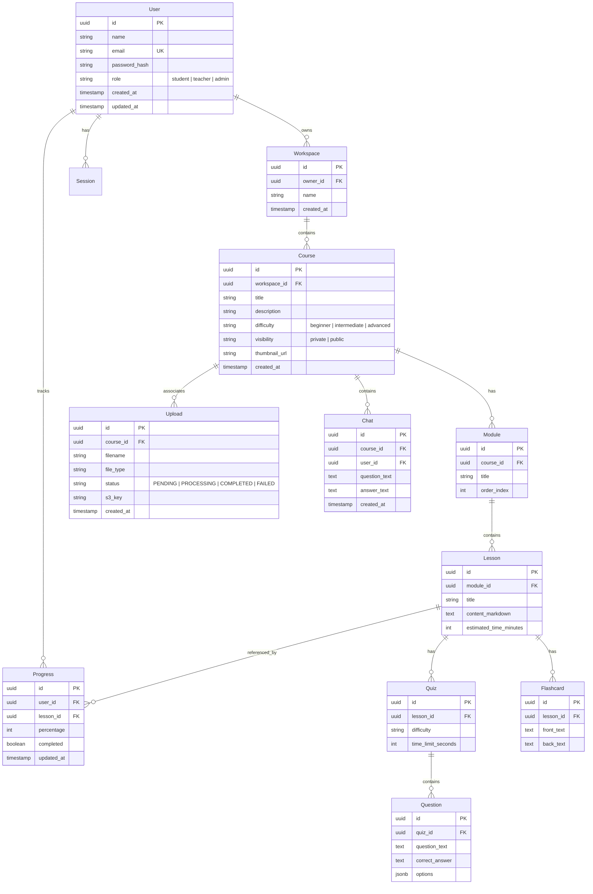

# Database Design Document - TeachStack

## 1. Entity Relationship Diagram (ERD)

TeachStack uses PostgreSQL as its primary relational store. Below is the relational model diagram.



---

## 2. Table Specifications & Indexes

### Users Table
- **Primary Key**: `id UUID DEFAULT gen_random_uuid()`
- **Indexes**:
  - `idx_users_email` (UNIQUE B-Tree on `email`): Speeds up authentication checkups.

### Workspace Table
- **Primary Key**: `id UUID DEFAULT gen_random_uuid()`
- **Indexes**:
  - `idx_workspaces_owner_id` (B-Tree on `owner_id`): Speeds up retrieving list of workspaces owned by a user.

### Course Table
- **Primary Key**: `id UUID DEFAULT gen_random_uuid()`
- **Indexes**:
  - `idx_courses_workspace_id` (B-Tree on `workspace_id`): Speeds up dashboard course lookups.

### Progress Table
- **Primary Key**: `id UUID DEFAULT gen_random_uuid()`
- **Indexes**:
  - `idx_progress_user_lesson` (UNIQUE B-Tree on `user_id, lesson_id`): Optimizes reading/updating progress for a user on specific lessons.

---

## 3. Sample DDL Migrations (PostgreSQL)

```sql
-- Create Enum Types
CREATE TYPE user_role AS ENUM ('student', 'teacher', 'admin');
CREATE TYPE course_difficulty AS ENUM ('beginner', 'intermediate', 'advanced');
CREATE TYPE course_visibility AS ENUM ('private', 'public');
CREATE TYPE upload_status AS ENUM ('PENDING', 'PROCESSING', 'COMPLETED', 'FAILED');

-- Enable UUID extension
CREATE EXTENSION IF NOT EXISTS "pgcrypto";

-- Create Users Table
CREATE TABLE users (
    id UUID PRIMARY KEY DEFAULT gen_random_uuid(),
    name VARCHAR(255) NOT NULL,
    email VARCHAR(255) UNIQUE NOT NULL,
    password_hash VARCHAR(255) NOT NULL,
    role user_role DEFAULT 'student',
    created_at TIMESTAMP WITH TIME ZONE DEFAULT CURRENT_TIMESTAMP,
    updated_at TIMESTAMP WITH TIME ZONE DEFAULT CURRENT_TIMESTAMP
);
CREATE INDEX idx_users_email ON users(email);

-- Create Workspaces Table
CREATE TABLE workspaces (
    id UUID PRIMARY KEY DEFAULT gen_random_uuid(),
    owner_id UUID NOT NULL REFERENCES users(id) ON DELETE CASCADE,
    name VARCHAR(255) NOT NULL,
    created_at TIMESTAMP WITH TIME ZONE DEFAULT CURRENT_TIMESTAMP
);
CREATE INDEX idx_workspaces_owner_id ON workspaces(owner_id);

-- Create Courses Table
CREATE TABLE courses (
    id UUID PRIMARY KEY DEFAULT gen_random_uuid(),
    workspace_id UUID NOT NULL REFERENCES workspaces(id) ON DELETE CASCADE,
    title VARCHAR(255) NOT NULL,
    description TEXT,
    difficulty course_difficulty DEFAULT 'intermediate',
    visibility course_visibility DEFAULT 'private',
    thumbnail_url VARCHAR(512),
    created_at TIMESTAMP WITH TIME ZONE DEFAULT CURRENT_TIMESTAMP
);
CREATE INDEX idx_courses_workspace_id ON courses(workspace_id);
```
