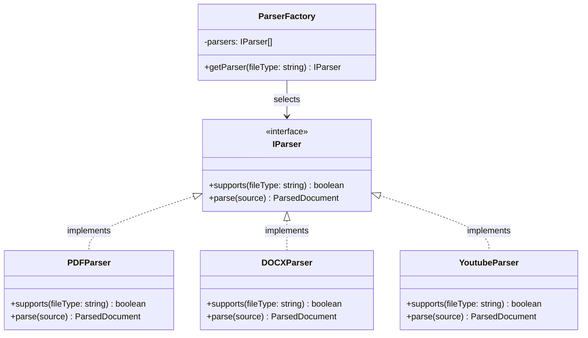
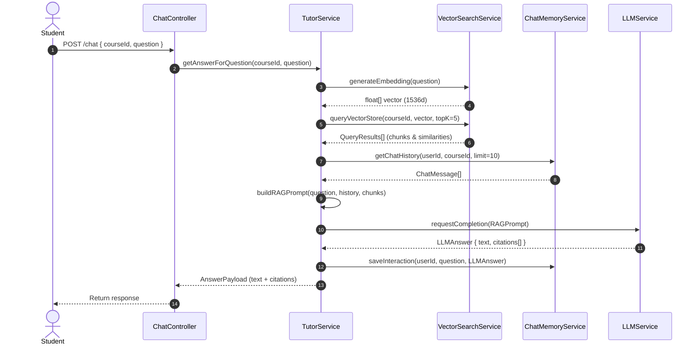

# Low-Level Design (LLD) - TeachStack

## 1. Class & Interface Diagrams

TeachStack leverages object-oriented design principles combined with NestJS's Dependency Injection. The core processing pipeline uses the **Strategy Pattern** for parsing diverse documents and the **Factory Pattern** for choosing the correct parser.

### Ingestion Parser interfaces & strategy pattern:

```typescript
export interface IParser {
  supports(fileType: string): boolean;
  parse(source: string | Buffer): Promise<ParsedDocument>;
}

export interface ParsedDocument {
  text: string;
  metadata: {
    title?: string;
    author?: string;
    totalPages?: number;
    wordCount: number;
    [key: string]: any;
  };
}
```



---

## 2. Sequence Diagram: Retrieval-Augmented Generation (RAG) Chat
This diagram illustrates the message sequence when a user submits a question to the `TutorService` to get an answer with source citations.



---

## 3. Core Core Services Interfaces

### VectorSearchService
Handles indexing and querying chunks in Qdrant.

```typescript
export interface EmbeddingPayload {
  id: string;
  vector: number[];
  payload: {
    courseId: string;
    uploadId: string;
    text: string;
    chunkIndex: number;
    metadata: Record<string, any>;
  };
}

export interface SearchResult {
  text: string;
  score: number;
  metadata: {
    uploadId: string;
    chunkIndex: number;
    [key: string]: any;
  };
}

export interface IVectorSearchService {
  upsertEmbeddings(collection: string, points: EmbeddingPayload[]): Promise<void>;
  searchSimilar(collection: string, vector: number[], filter: Record<string, any>, limit: number): Promise<SearchResult[]>;
}
```

### CourseGeneratorService
Executes syllabus generation and prompts the LLM to format course contents.

```typescript
export interface CourseOutline {
  title: string;
  description: string;
  modules: {
    title: string;
    order: number;
    lessons: {
      title: string;
      learningObjectives: string[];
      estimatedTimeMinutes: number;
    }[];
  }[];
}

export interface ICourseGeneratorService {
  generateOutline(contextText: string, preferences: CoursePreferences): Promise<CourseOutline>;
  generateLessonContent(lessonTitle: string, objectives: string[], contextText: string): Promise<string>; // returns Markdown
}
```
