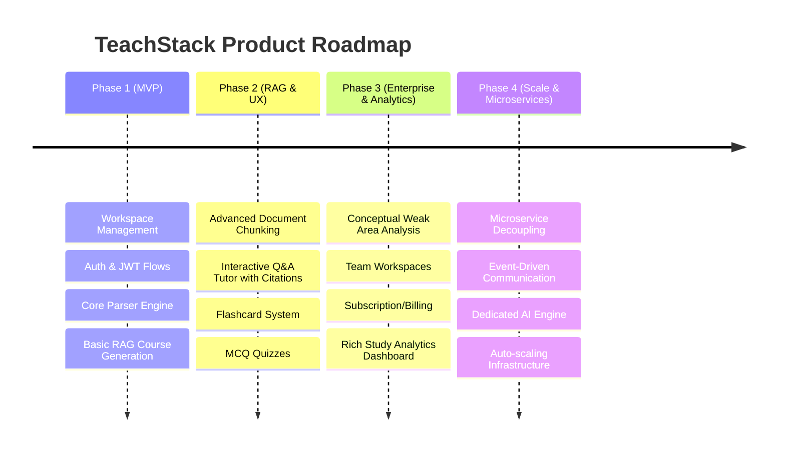

# Product Requirements Document (PRD) - TeachStack

## 1. Introduction & Product Vision
TeachStack is an AI-powered personalized learning platform that transforms raw inputs (PDFs, DOCX, PPTs, GitHub Repositories, YouTube Videos, and Websites) into structured, interactive, and personalized courses. The platform aims to bridge the gap between unstructured information and educational roadmap progression, providing users with dynamic study materials, instant AI tutoring, practice quizzes, flashcards, and progress tracking.

---

## 2. Target Personas

### Persona A: Sarah - The Self-Guided Learner (Student / Professional)
* **Background**: Software engineer wanting to learn Rust or university student studying chemistry.
* **Needs**: 
  - Ability to upload custom materials (textbooks, doc folders).
  - Clear learning path (roadmaps, modules).
  - Quick interactive tools (flashcards, mock questions).
  - Immediate clarification on confusing concepts.
* **Pain Points**: Information overload, lacks structured curriculum from raw materials, doesn't know where they have gaps in knowledge.

### Persona B: Prof. James - The Educator / Content Creator
* **Background**: University professor or corporate technical trainer.
* **Needs**:
  - Ability to drop standard syllabus documents or GitHub repos.
  - Automatically scaffold courses for their students.
  - Ability to export generated quizzes/materials.
  - Review student progress and understand weak areas.
* **Pain Points**: Scaffolding new courses takes weeks; grading subjective questions is time-consuming; difficult to identify class-wide conceptual gaps.

### Persona C: Platform Administrator
* **Background**: System administrator / Operations manager.
* **Needs**:
  - User and workspace management.
  - System usage, token consumption, and rate limit configuration dashboard.
  - Content moderation and security logs.
* **Pain Points**: High API costs, malicious uploads, database scaling issues.

---

## 3. Core User Stories & Features

| Feature Area | User Story | Acceptance Criteria | Priority |
|---|---|---|---|
| **Onboarding** | As a new user, I want to register and create a workspace so that I can organize my studies. | Email validation, JWT and OAuth flow, default workspace creation on sign-up. | High |
| **Ingestion** | As a student, I want to upload files (PDF/DOCX/PPT/ZIP) and URLs (YouTube/GitHub) so that the system can process them. | S3 upload with pre-signed URLs, size validation (<50MB), antivirus scanning, metadata storage. | High |
| **Pipeline** | As a student, I want my uploads to process in the background so that the interface remains responsive. | BullMQ queue worker parsing text, emitting completion/error notifications, status API. | High |
| **Course Gen** | As a student, I want the system to generate a structured course outline with modules and roadmaps. | LLM-generated JSON format output matching DB schema (Modules -> Lessons), published/draft status. | High |
| **Interactive Study** | As a student, I want to read clean markdown lessons and chat with a RAG tutor for source citations. | Markdown support in UI, conversational memory, Qdrant-backed semantic search, source highlights. | High |
| **Assessment** | As a student, I want to take generated quizzes (MCQ/Coding) and study flashcards to test my knowledge. | Auto-graded MCQs, subjective question evaluation with LLM, interactive flashcard deck. | High |
| **Analytics** | As a user, I want to see my daily streak, study time, and conceptual weak areas on a dashboard. | Streak tracker, lesson completion percentage updates, visual graph of weak concepts. | Med |

---

## 4. Success Metrics (KPIs)
* **User Engagement**: Daily Active Users (DAU), Monthly Active Users (MAU), average study session duration (>20 minutes target).
* **Generation Quality**: LLM response validation rate (>95% JSON conformity), RAG hallucination rate (<3% on evaluated test set).
* **Performance**: Course generation completion time (<45 seconds), RAG chat response latency (<2 seconds first token).
* **Reliability**: Queue task success rate (>99.5%), overall API uptime (99.9%).
* **Educational Impact**: Subjective/MCQ score improvement over time, daily streak retention rate (7-day retention >40%).

---

## 5. Product Roadmap

