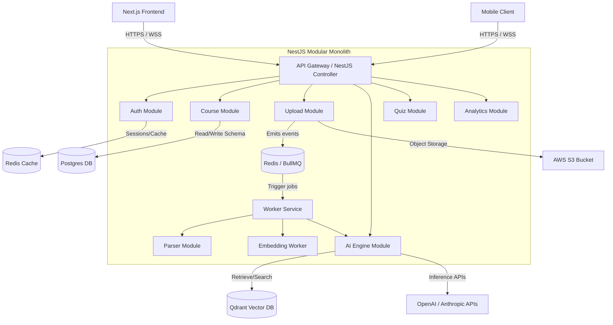
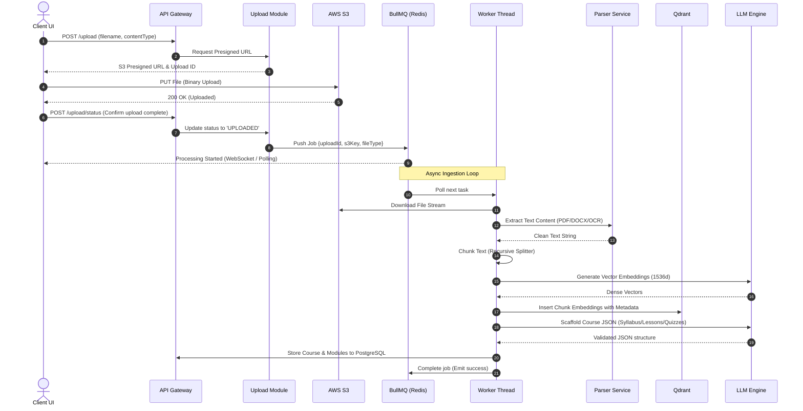

# System Design Document (SDD) - TeachStack

## 1. High-Level Architecture
TeachStack starts as a modular monolith written in TypeScript using NestJS, laying the groundwork for a transition to a microservices architecture. It separates domain logic into distinct, loosely-coupled modules that communicate via clean typescript interfaces and event emitter queues.

---

## 2. Ingestion & AI Pipeline Data Flow
Processing documents asynchronously ensures reliability, scalability, and an excellent user experience. 

---

## 3. Module & Service Decomposition

### Auth Module
- **Responsibilities**: Registration, login, JWT issuance, refresh tokens, role-based access control (RBAC).
- **Security**: Password hashing using bcrypt, rate-limiting on endpoints, session revocation.

### Upload Module
- **Responsibilities**: Mime-type checking, pre-signed URL generation, malware checks, storage lifecycle config.
- **Security**: Signed URLs with expiration (5 mins), strict file size limits (<50MB).

### Parser Module
- **Responsibilities**: Standardizing diverse formats (PDF, DOCX, PPTX, GitHub text contents, YouTube transcript scraper) into clean text strings.
- **Processors**: PDF-Parse, Docx-parser, Mammoth, Puppeteer (Web scraping), OCR (Tesseract).

### AI Engine Module (RAG)
- **Responsibilities**: Chunking strategy execution, embedding creation, vector index management, retrieval prompt synthesis.
- **Components**: Vector search client (Qdrant), chunking utilities, LLM driver interfaces.

### Course Module
- **Responsibilities**: Storing and serving the generated hierarchical curriculum (Course -> Module -> Lesson -> Flashcard).
- **Operations**: Outline CRUD, lesson content updates, roadmap progression.

### Tutor & Quiz Modules
- **Responsibilities**: Retrieval-Augmented Generation (RAG) chat sessions with context citations; MCQ, coding, and subjective quiz generation and evaluation.

### Analytics Module
- **Responsibilities**: Daily streak tracking, lesson completion progress, study duration calculations, and identification of conceptual weak areas.

---

## 4. Scalability & Event Strategy
- **Decoupled Workers**: The workers executing heavy tasks (parsing, LLM calls, embedding generation) run as separate node processes. They can scale horizontally on ECS based on BullMQ queue depth.
- **Caching Layer**: Redis caches database query results for courses/lessons, rate limit counters, user sessions, and locks to prevent duplicate course generations.
- **Vector Index Optimization**: Qdrant runs with HNSW indexes configured for fast cosine-similarity search, filtered by metadata (e.g., `course_id`, `workspace_id`).
